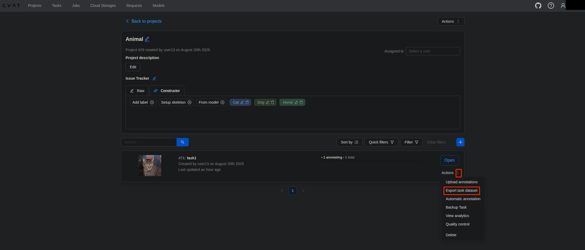
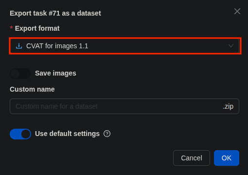
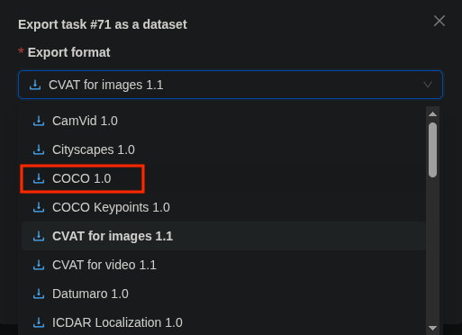
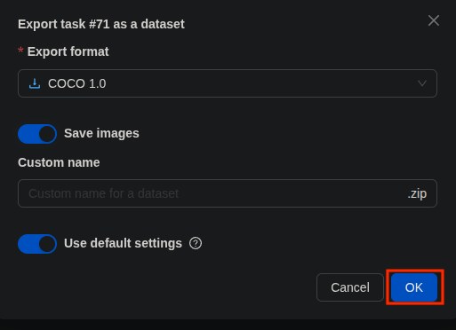
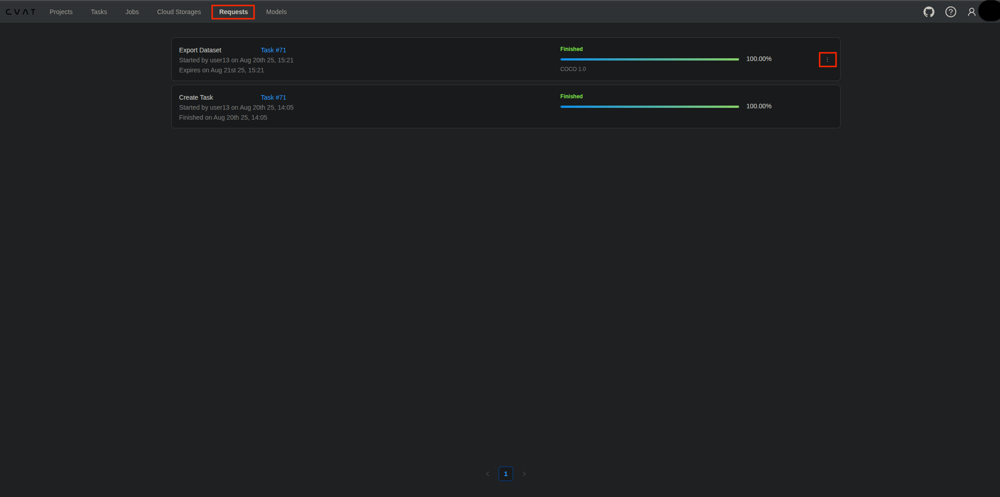
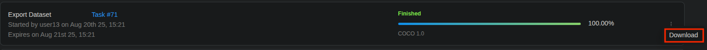

# 8월 20일

## Docker
- “컨테이너”를 만들고 실행·배포하는 플랫폼
- 컨테이너는 앱과 그 앱이 필요한 라이브러리/설정을 **한 묶음(이미지)**으로 담아, 어디서 돌려도 똑같이 동작하게 하는 가벼운 격리 실행 환경이다.
- [사이트 참고](https://docs.docker.com/engine/install/ubuntu/)

### 설치
1. Set up Docker's apt repository.
```bash
# Add Docker's official GPG key:
sudo apt-get update
sudo apt-get install ca-certificates curl
sudo install -m 0755 -d /etc/apt/keyrings
sudo curl -fsSL https://download.docker.com/linux/ubuntu/gpg -o /etc/apt/keyrings/docker.asc
sudo chmod a+r /etc/apt/keyrings/docker.asc

# Add the repository to Apt sources:
echo \
  "deb [arch=$(dpkg --print-architecture) signed-by=/etc/apt/keyrings/docker.asc] https://download.docker.com/linux/ubuntu \
  $(. /etc/os-release && echo "${UBUNTU_CODENAME:-$VERSION_CODENAME}") stable" | \
  sudo tee /etc/apt/sources.list.d/docker.list > /dev/null
sudo apt-get update
```
2. Install the Docker packages.
```bash
sudo apt-get install docker-ce docker-ce-cli containerd.io docker-buildx-plugin docker-compose-plugin
sudo usermod -a -G docker $USER
```
3. Verify that the installation is successful by running the hello-world image:
```bash
sudo docker run hello-world
```

## CVAT
- 무료이며 오픈 소스인 웹 기반 이미지 및 비디오 주석 도구로, 컴퓨터 비전알고리즘을 위한 데이터 라벨링에 사용.

### 설치
```bash
git clone https://github.com/cvat-ai/cvat
cd cvat
git checkout v2.37.0
export CVAT_HOST=<IP Address> # http://<IP Address>:8080/, ubuntu 주소
docker compose -f docker-compose.yml -f components/serverless/docker-compose.serverless.yml up -d
docker exec -it cvat_server bash -ic 'python3 ~/manage.py createsuperuser' # 본인이 사용할 어드민 계정 입력
```
```bash
# Nuclio CLI(nuctl) 바이너리 다운로드 – CVAT의 서버리스(자동 라벨링)를 배포/관리할 때 쓰는 명령줄 도구
wget https://github.com/nuclio/nuclio/releases/download/1.13.0/nuctl-1.13.0-linux-amd64
sudo chmod +x ./nuctl-1.13.0-linux-amd64
# 시스템 PATH에 배치(모든 사용자 공용으로 쓰기 위해 /usr/local/bin으로 이동)
sudo mv nuctl-1.13.0-linux-amd64 /usr/local/bin/
# 버전명 파일을 일반 이름(nuctl)로 심볼릭 링크 → 이후 버전 교체가 쉬움
sudo ln -s /usr/local/bin/nuctl-1.13.0-linux-amd64 /usr/local/bin/nuctl
# CVAT가 제공하는 기본 오토 어노테이션 모델들을 Nuclio에 “배포”
#   - nuctl을 이용해 'cvat' 프로젝트와 여러 함수(탐지/분할 등 CPU용 모델)를 생성
#   - 배포가 끝나면 CVAT UI의 Models/Auto annotation 목록에 모델이 나타남
./serverless/deploy_cpu.sh
```

### CVAT Export








## Datumaro
- 이미지, 비디오, 포인트 클라우드 등 다양한 데이터셋을 지원하며, 라벨링이 완료된 데이터셋의 포맷 변환, 병합, 분할, 데이터셋 비교, 품질 검사, 데이터셋 분석 등을 지원하는 오픈소스 Tool
- [링크](https://github.com/open-edge-platform/datumaro)

### 설치

```bash
mkdir datumaro 
cd datumaro
python3 -m venv .venv
source .venv/bin/activate
pip install datumaro[default]
datum --help
```

### 실행방법
```bash
# Creates a project in the current working directory
datum project create -o car-human-dataset

# Import datasets to the project, after creating the project
datum source import -f coco -n source1 /home/ubuntu03/Intel_class/animalzip
# In this example, import cvat-car-human coco datasets to source1 directory under the project with naming it train
# 마지막 경로는 CVAT에서 Labeling이 완료된 Task를 Export 한거를 unzip으로 푼 경로

# Splits a dataset for model training
datum transform -t split -- -t detection --subset train:.7 --subset val:.2 --subset test:.1
# In this example, split car-human datasets by ratio for detection.

# Export a dataset for model training
datum project export -f coco -- --save-media
# In this example, dataset is exported as a coco dataset including images.
```